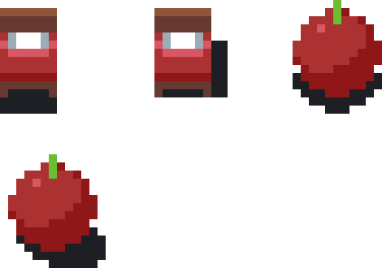
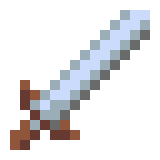
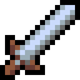
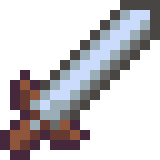
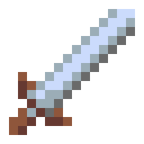
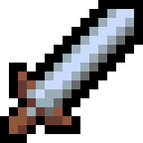
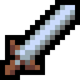
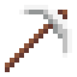
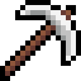
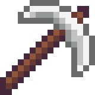

<!-- PIXELART PROJECT TITLE -->
# 2D-Fundamental-Techniques---PixelArt

<!-- PIXELART PROJECT SPRITES -->
- Introduction to Pixels  

- Lines & Curves  
.png)

- Simple shading  

- Highlighting  

- Dithering  

- Shadows  

- Outlines  

 

- Color palettes  

- Rotating objects  

 

- Camera Angle & Perspectives
